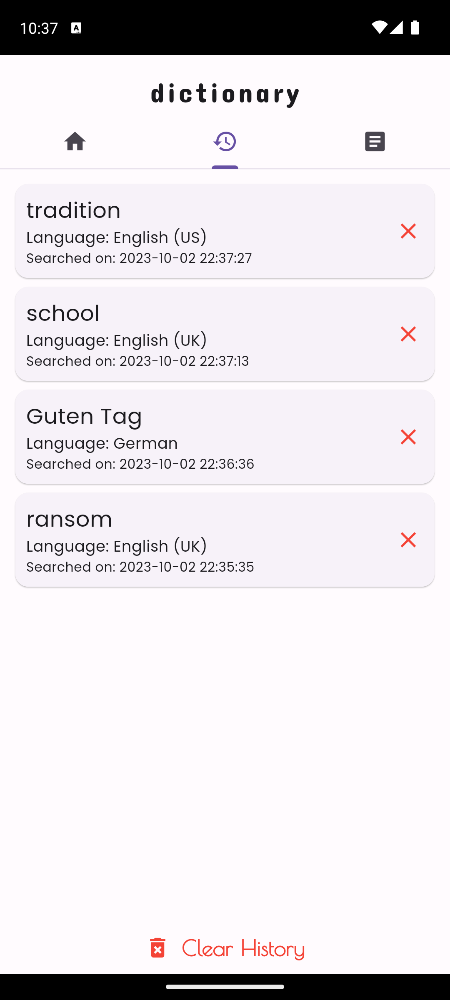
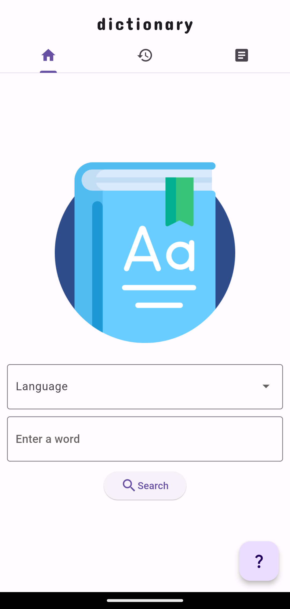
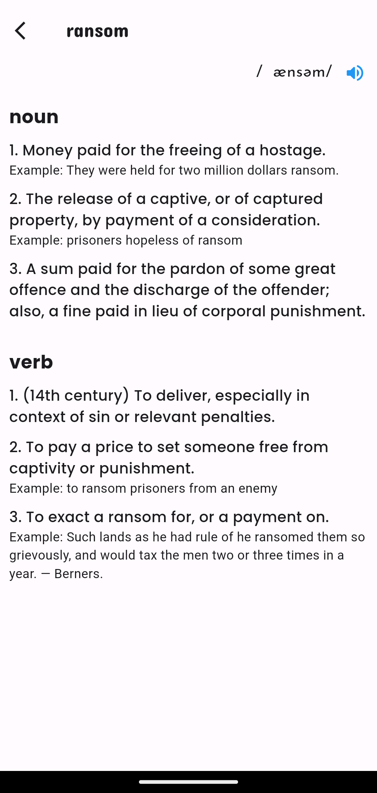

# Flutter Dictionary

Flutter Dictionary is a mobile app that allows you to search for the meanings of words in different languages. You can also listen to the pronunciation of the words and save them to your favorites list.

## Features

- Search for words in English, Spanish, French, Russian, German, Italian, Hindi, Japanese, Arabic and Korean
- Listen to the pronunciation of the words
- Save words to your favorites list
- View your search history

|  |  |  |
| :---: | :---: | :---: |
| *Search History Screen* | *Home Screen* | *Defnition Screen* |

- Now Have Error Animation


## Installation

To run this app, you need to have Flutter installed on your machine. Then, clone this repository and navigate to the project folder. Run the following commands to install the dependencies and launch the app:

```bash
flutter pub get
flutter run
```

## Usage

To use the app, enter a word in the search bar and select a language from the dropdown menu. You will see the definition, synonyms, antonyms, and examples of the word. You can also tap on the speaker icon to hear the pronunciation of the word. To save a word to your favorites list, tap on the star icon. To view your favorites list or your search history, tap on the menu icon on the top left corner. To switch between dark and light mode, tap on the moon icon on the top right corner.

## Contribution

This project is open for contributions. If you want to contribute, please follow these steps:

- Fork this repository
- Clone the repository
- Create a branch with your feature or bug fix name
- Make your changes and commit them
- Push your branch and create a pull request
- Wait for feedback and approval
- Please make sure to follow the code style and commit message conventions.

## License

This project is licensed under the MIT License.

[](https://play.google.com/store/apps/details?id=dangerahead.dictionary&pcampaignid=web_share)

[](https://www.amazon.com/gp/product/B09BG7C574)

## API Resources

#### Used [freeDictionaryAPI](https://github.com/meetDeveloper/freeDictionaryAPI) for fetching meanings.

#### Used [Random-Words-API](https://github.com/mcnaveen/Random-Words-API) for fetching random words.

## Attributions:

#### By Ha1992ya - Own work, CC BY-SA 4.0, https://commons.wikimedia.org/w/index.php?curid=47290666

#### [GitHub Logo](https://github.githubassets.com/images/modules/logos_page/GitHub-Mark.png)

#### `icon.png` by [Freepik](https://www.freepik.com) from [Flaticon](https://www.flaticon.com/)

#### `available at amazon appstore` logo from [Logopedia | Fandom](https://logos.fandom.com/wiki/Amazon_Appstore)
